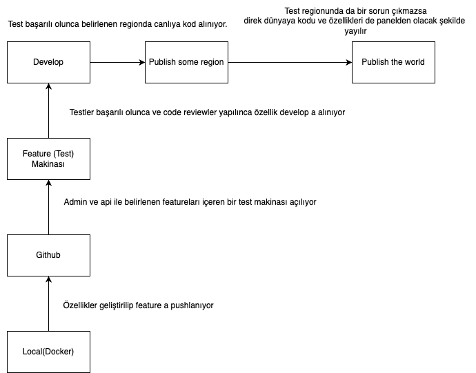

#ANA PLAN

##Açıklamalar
1. Özellikler geliştirilip feature a pushlanıyor
2. Admin ve api ile belirlenen featureları içeren bir test makinası açılıyor
3. Testler başarılı olunca ve code reviewler yapılınca özellik develop a alınıyor
4. Test başarılı olunca belirlenen regionda canlıya kod alınıyor.
5. Test regionunda da bir sorun çıkmazsa direk dünyaya kodu ve özellikleri de panelden olacak şekilde yayılır

##Makina Özellikleri

