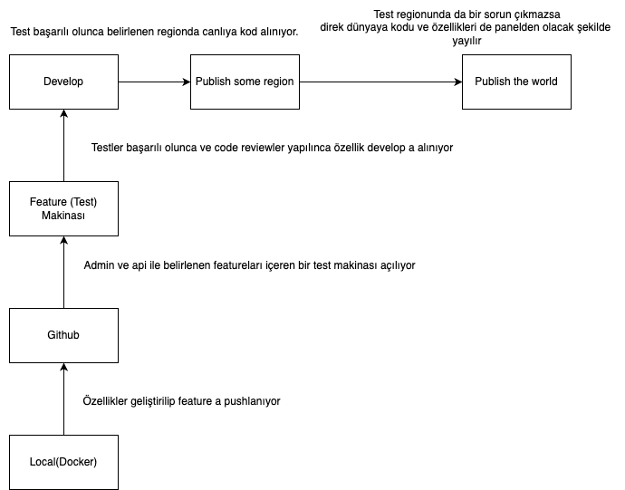

#ANA PLAN

##Açıklamalar
1. Özellikler geliştirilip feature a pushlanıyor
2. Admin ve api ile belirlenen featureları içeren bir test makinası açılıyor
3. Testler başarılı olunca ve code reviewler yapılınca özellik develop a alınıyor
4. Test başarılı olunca belirlenen regionda canlıya kod alınıyor.
5. Test regionunda da bir sorun çıkmazsa direk dünyaya kodu ve özellikleri de panelden olacak şekilde yayılır

#Makina Özellikleri

Feature Makinası: 
1. ec2 instance olarak t2.micro ayağa kaldırılabilir.
2. Autoscaling yok
3. Load Balancing yok
4. Ayağa kalkmasının hızlı olması için docker kullanılabilir.

Develop:
1. Tr de olduğumuz için buraya yakın bir yerde açılır.
2. Aynı makinada redis ayağa kalkar. datalar burada tutulur.
3. Autoscaling yok
4. Load Balancing yok

Main: 
1. Sistemin local geliştirme ortamıyla aynı olması açısından docker kullanılabilir.
2. Auto Scaling var.
3. Load Balancing var
4. Region bazlı tutulmalıdır.
5. Deploy süreçlerinde her bölge için ayrı deploy senaryoları oluşturulmalıdır.

#Mimari
1. Microservice mimarisi kullanılır.Hem deploy edilmesi hem yönetimi daha rahat olur. Monolith yapıya hakimiyetin ve adaptasyonun da zor olacağı düşünülünce bu bana mantıklı geldi
2. İstek tek bir servise gelir. Orada jwt tokendan user ayrımı ile ilgili parçalamalar (hangi servise gidecek, parametrelerin ayrışması) yapılır. 
3. Sadece bu servisten gelen isteklere cevap verecek şekilde mikroservislerin instanceleri ayarlanır.
4. Go dilinde bu servis yazılırsa istekleri karşılamada ve yük dağıtımında bir sorun yaşanmayacaktır.
5. Request bu servise gelir. Mikroservise istek iletilir. Ardından mikroservisten gelen cevap işlenip şifrelenerek gerekirse client a iletilir.
6. msgpack paketi kullanılabilir.

